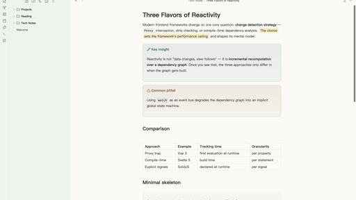
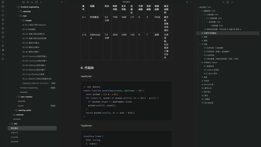

# Jadeveil 玉幕

> *Warm as jade, clear as glass.* An Obsidian theme built for Chinese technical writing — translucent jade chrome carrying warm ivory paper.

 

## Design

Jadeveil's core metaphor is **"a jade veil carrying paper and ink"** (玉幕承载纸墨): navigation and controls float as translucent jade glass above the content, while the reading surface stays solid, quiet, and highly readable.

- **温从纸来 · Warmth from paper** — light mode uses a warm ivory paper (`#FBFAF7`), not clinical white; the whole gray ladder is warm-tuned to match
- **润从玻璃来 · Smoothness from glass** — sidebars, ribbon, and status bar are genuinely translucent (`backdrop-filter` glass) so ambient desktop color breathes through the veil
- **清透从 alpha 来 · Clarity from alpha** — glass density is user-tunable per mode via Style Settings sliders
- **青玉 accent** — a low-saturation jade accent system (hue 166°, S 46%). Checkboxes, tags, selection, callouts, and focus rings all derive from it; sweep the hue slider and the whole theme re-tints without ever turning neon

## Highlights

- **CJK typography, taken seriously** — `text-autospace` / `text-spacing-trim` progressive enhancement, `word-break: auto-phrase` headings, CJK-safe code line-height, 42 em measure (~42 full-width chars/line), ligatures disabled in code for source fidelity
- **Accessibility calibrated in both modes** — body text 13.0:1 (light) / 11.4:1 (dark); links, code syntax palette, callout titles, checkbox glyphs, and focus indicators all pass WCAG AA, verified by independent review
- **Semantic task states** — `[-]` cancelled, `[>]` forwarded, `[?]` question each get distinct checkbox glyphs and colors
- **Full callout family** re-tuned to a jade palette with hue stepping, so `note` / `info` / `tip` / `success` stay distinguishable at a glance
- **Print-safe** — `@media print` resets to black-on-white and strips glass/shadows

## Requirements & notes

- **Translucency**: the glass effect needs Obsidian's *Settings → Appearance → Translucent window* turned on (macOS). Without it — or in fullscreen — the theme degrades gracefully to solid matte surfaces. A "disable all glass" escape hatch is also provided for performance-sensitive setups.
- **Fonts**: uses system font stacks only (SF Pro / PingFang on macOS, falls back to Hiragino / Microsoft YaHei elsewhere). Nothing is loaded remotely.
- **[Style Settings](https://github.com/mgmeyers/obsidian-style-settings)** (optional): exposes glass blur/density sliders, accent hue, font metrics, paper tone, OLED black, code line numbers, and more. The theme works fine without it using built-in defaults.

## Engineering

`theme.css` opens with a **maintenance contract**: public vs. internal token tiers, variant rules ("variants may only remap tokens"), an **`!important` ledger** (every one registered with the app.css rule it fights), and a dependency ledger (D1–D6) tracking every undocumented Obsidian internal the theme touches. QA tooling (static lint + runtime smoke tests) lives in the maintainer's source repository and is not part of this distribution.

Comments are written in Chinese — the theme targets Chinese technical writing and the comments are part of its design record. Section headers are numbered (§0–§10) for navigation.

## Install

Until it lands in the community theme store: download `manifest.json` and `theme.css` into `<vault>/.obsidian/themes/Jadeveil/`, then select **Jadeveil** under *Settings → Appearance → Themes*.

## 中文简介

Jadeveil（玉幕）是为中文技术写作打造的 Obsidian 主题。核心隐喻是"玉幕承载纸墨"：导航与控件如半透明玉璃悬浮于内容之上，正文保持安静、稳定、高可读。温从纸来（暖象牙纸）、润从玻璃来（真实 backdrop-filter 玻璃）、清透从 alpha 来（浓度滑杆可调）。低饱和青玉 accent 全局派生，色相滑杆扫过任意颜色都不出霓虹。中文排版细节（中西文空隙、标点挤压、CJK 行高、代码连字禁用）与双模式 WCAG AA 对比度均经独立评审校准。

## License

[MIT](LICENSE) © PaddyChen

*Typography density and material restraint informed by Apple's Human Interface Guidelines and contemporary document editors.*
