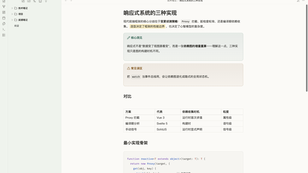
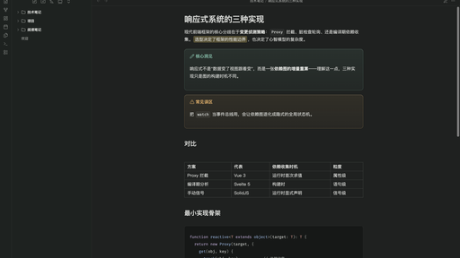

# Jadeveil 玉幕

[English](README.md) | 中文

为中文技术写作调校的 Obsidian 主题：半透明侧栏、暖纸色阅读面、低饱和青玉强调色。

| 浅色 | 深色 |
|---|---|
|  |  |

## 特性

- 侧栏 / Ribbon / 状态栏真实半透明（`backdrop-filter`），深浅模式各有一个浓度滑杆
- 浅色模式暖象牙纸底，深色模式石墨底
- 一个强调色相驱动 checkbox、标签、选区、焦点环和 callout——色相滑杆可调，饱和度压低，扫到任何位置都不出荧光色
- 中文排版细节：`text-autospace` / `text-spacing-trim`（按浏览器支持渐进启用）、CJK 友好行高、代码块禁用连字
- 双模式对比度校验（正文约浅 13:1 / 深 11:1；链接、语法高亮、callout 题字达 WCAG AA）
- 扩展任务状态：`[-]` 取消、`[>]` 顺延、`[?]` 疑问
- 兜底可靠：`@media print` 回退白纸黑字；未开启窗口透明时整体退化为实心面

## 使用前提

- 玻璃效果需要开启 **设置 → 外观 → 半透明窗口**（macOS）。不开也能用，退化为实心面；另有"关闭全部玻璃"开关照顾性能敏感场景。
- 字体只用系统字体栈（SF Pro / 苹方，非 macOS 回退冬青黑体 / 微软雅黑），不从网络加载任何资源。
- [Style Settings](https://github.com/mgmeyers/obsidian-style-settings) 插件可选——用于调节玻璃浓度、强调色相、字号行宽、OLED 纯黑、代码行号等。不装也有合理默认值。

## 安装

上架社区主题商店之前：把 `manifest.json` 和 `theme.css` 复制到 `<你的库>/.obsidian/themes/Jadeveil/`，然后在 *设置 → 外观 → 主题* 里选择 **Jadeveil**。

## 说明

`theme.css` 有密集的中文注释——变量结构、每个 `!important` 存在的原因、主题依赖了哪些 Obsidian 内部实现。设计取舍见 [`DESIGN.md`](DESIGN.md)。

## 许可

[MIT](LICENSE)
